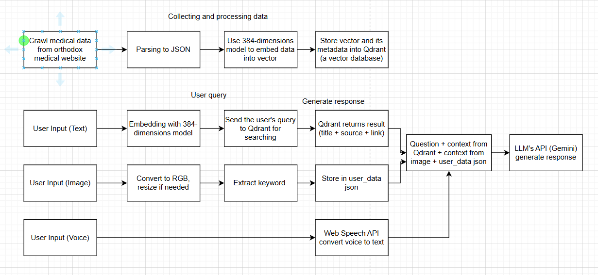

# 🩺 HealthTrust – Nền tảng theo dõi & tư vấn sức khỏe cá nhân

**HealthTrust** là một nền tảng hỗ trợ theo dõi sức khỏe cá nhân, cung cấp cảnh báo theo vị trí, công cụ tra cứu y tế, và tư vấn sức khỏe thông qua trí tuệ nhân tạo. Giao diện thân thiện, dễ sử dụng cho mọi đối tượng.

🔗Website: https://www.healthtrust.live/

Google PageSeed

<ảnh>

---
# Sơ đồ kiến trúc tổng quan hệ thống.

Hệ thống được chia thành ba phần chính:

---

## 1. Client Side (Phía Client)

- **Thành phần**: Ứng dụng website
- **Công nghệ**: ReactJS, Tailwind CSS
- **Chức năng chính**:
  - Hiển thị giao diện người dùng (User Interface)
  - Nhận đầu vào từ người dùng và xử lý tương tác
  - Gửi các yêu cầu HTTP đến Server thông qua API
  - Tiếp nhận dữ liệu trả về từ Server để cập nhật giao diện

---

## 2. Server Side (Phía Server)

- **Thành phần**: Hệ thống API
- **Công nghệ**: Node.js, Express.js
- **Cơ sở dữ liệu**: MongoDB, ElasticSearch
- **Chức năng chính**:
  - Xử lý các yêu cầu API từ Client
  - Truy vấn cơ sở dữ liệu MongoDB, ElasticSearch (truy vấn khi tìm kiếm thuốc)
  - Xác thực người dùng (Authentication)
  - Xử lý logic nghiệp vụ (ví dụ: gửi email, lấy dữ liệu thời tiết,...)
  - Trả về kết quả (HTTP Response) cho phía Client

---

## 3. Third Party Services (Các dịch vụ bên thứ ba)

- **SendGrid**:
  - Dùng để gửi email từ Server đến Client (ví dụ: xác thực tài khoản, đặt lại mật khẩu,...)
  - Giao thức: SMTP

- **Google OAuth 2.0**:
  - Cho phép người dùng đăng nhập bằng tài khoản Google
  - Server trao đổi mã `authorization code` để lấy `access_token`/`id_token` từ Google

- **OpenWeather**:
  - Cung cấp dữ liệu thời tiết (nhiệt độ, độ ẩm, điều kiện thời tiết,...)
  - Server gọi API của OpenWeather để lấy thông tin phục vụ các tính năng như dự báo thời tiết hoặc nhắc nhở sức khỏe

---

# Truyền thông giữa các thành phần

## 1. Client ↔ Server

- **Mục đích**: Giao tiếp dữ liệu khi người dùng tương tác với giao diện
- **Cách thức**:
  - Client (ReactJS) gửi các HTTP request (GET, POST, PUT, DELETE) đến các API endpoint của Server (Express.js)
  - Server xử lý yêu cầu, có thể truy vấn MongoDB, sau đó trả về HTTP response (thường là JSON) cho Client

## 2. Server ↔ Third Party Services ↔ Client

### Gửi email qua Gmail SMTP:
- Khi cần gửi email (xác thực, quên mật khẩu,...), Server sử dụng SMTP để gửi thông qua Gmail
- Nội dung email được tạo sẵn và được gửi tới người dùng

### Lấy dữ liệu thời tiết từ OpenWeather:
- Server gọi HTTP GET tới API của OpenWeather kèm theo API Key và thông số địa lý
- Nhận dữ liệu JSON từ OpenWeather, xử lý và trả về kết quả cho Client hiển thị

## 3. Client ↔ Third Party Services (OAuth 2.0)

### Đăng nhập bằng Google:
1. Người dùng nhấn "Đăng nhập với Google" trên giao diện ReactJS
2. Client chuyển hướng tới `/auth/google` trên Server
3. Server sử dụng Passport để chuyển hướng trình duyệt đến Google (authorization endpoint)
4. Sau khi xác thực, Google chuyển hướng về `/auth/google/callback` cùng với authorization code
5. Server trao đổi mã code để lấy `access_token` hoặc `id_token`, sau đó lấy thông tin người dùng, tạo JWT (hoặc session), lưu cookie và chuyển hướng trở lại ứng dụng Client

---

## Cơ sở dữ liệu (MongoDB)

---
## Tính năng chính

- Đăng nhập, đăng ký:
	- Tạo tài khoản mới.
	- Đăng nhập để sử dụng các chức năng cá nhân hóa.
	- Quên mật khẩu? Có thể đặt lại dễ dàng qua email.
	- Thay đổi mật khẩu dễ dàng trong phần cài đặt.
- Cảnh báo sức khỏe theo vị trí:
	- Ứng dụng sẽ hỏi quyền truy cập vị trí của bạn (chỉ khi được cho phép).
	- Khi được cấp quyền truy cập vị trí, hệ thống sẽ tự động đưa ra cảnh báo về thời tiết và các nguy cơ sức khỏe liên quan (nắng nóng, cảm lạnh, v.v.).
- Tra cứu thuốc:
	- Tìm kiếm tên thuốc, công dụng, cách dùng và chống chỉ định.
	- Hỗ trợ tìm kiếm thông minh kể cả khi không nhớ chính xác tên thuốc.
- Tra cứu thông tin bệnh:
	- Cung cấp thông tin về triệu chứng, nguyên nhân, cách điều trị các bệnh thường gặp.
	- Nội dung được chọn lọc từ các nguồn y tế uy tín.
- Công cụ tính toán sức khỏe:
	- **BMI** – tính chỉ số khối cơ thể.
	- **Nhu cầu calo hằng ngày** – tính toán theo giới tính, tuổi, chiều cao, cân nặng và mức độ vận động.
	- **Cân nặng lý tưởng** – gợi ý mức cân phù hợp theo chiều cao và độ tuổi.
	- **Tỷ lệ mỡ cơ thể** – ước tính dựa trên các thông số như vòng cổ, vòng eo, chiều cao.
- Lịch hiến máu:
	- Hiển thị các đợt hiến máu theo khu vực gần nhất.
- Tin tức sức khỏe:
	- Cập nhật tin tức theo nhóm bệnh: tim mạch, hô hấp, thần kinh,...
	- Nguồn tin được chọn lọc từ báo chí và tổ chức y tế có độ tin cậy cao.
- Phân tích hình ảnh da liễu:
	- Cho phép tải lên ảnh vùng da bị tổn thương để phân tích.
	- Hệ thống sử dụng mô hình học sâu để hỗ trợ nhận diện một số bệnh lý da phổ biến (ví dụ: mụn, vảy nến,...).
- Chatbot tư vấn:
	- Hỗ trợ trò chuyện và cung cấp thông tin liên quan đến các vấn đề sức khỏe thường gặp.
---
## Công nghệ sử dụng.

| Thành phần        | Mô tả                                                             |
| ----------------- | ----------------------------------------------------------------- |
| Giao diện         | ReactJS, TailwindCSS – tối ưu trải nghiệm người dùng, tốc độ cao. |
| Máy chủ (Backend) | Node.js + Express.js – xử lý dữ liệu và điều phối các chức năng.  |
| Cơ sở dữ liệu     | MongoDB – lưu trữ thông tin người dùng và dữ liệu liên quan.      |
| Tính năng AI      | Mô hình học sâu cho phân tích ảnh, chatbot AI, định vị địa lý     |

---

## Luồng đăng ký đăng nhập

## AI phân tích bệnh da liễu.

---
## Chatbot AI Sử Dụng Kỹ Thuật RAG (Retrieval-Augmented Generation)

Đây là hệ thống chatbot thông minh được thiết kế để hỗ trợ người dùng trong việc tra cứu thông tin sức khỏe một cách chính xác và dễ hiểu. Chatbot sử dụng kỹ thuật tiên tiến có tên là RAG - Retrieval-Augmented Generation, hay còn gọi là Tìm kiếm tăng cường tạo sinh. Điều này có nghĩa là chatbot không chỉ tạo câu trả lời dựa trên kiến thức đã học sẵn, mà còn chủ động tìm kiếm thông tin liên quan trong một kho dữ liệu riêng, giúp tăng độ chính xác và tính cập nhật của phản hồi.

### 1. Thu thập và xử lý dữ liệu ban đầu
Để chatbot có kiến thức y tế đáng tin cậy, dữ liệu cần được chuẩn bị kỹ lưỡng qua các bước sau:

**Bước 1:** Thu thập thông tin

- Chatbot được "nuôi dưỡng" bằng thông tin từ các trang web y tế có uy tín (Vinmec).

- Các thông tin này có thể bao gồm bài viết, hướng dẫn, thống kê, và tài liệu chuyên môn.

**Bước 2:** Chuẩn hóa định dạng

- Sau khi thu thập, dữ liệu được chuyển thành định dạng có cấu trúc (JSON). Việc chuẩn hóa này giúp hệ thống xử lý và hiểu thông tin dễ dàng hơn.

**Bước 3:** Chuyển nội dung thành dữ liệu số

- Các đoạn văn bản được đưa vào một mô hình đặc biệt gọi là mô hình nhúng (embedding model). Mô hình này sẽ chuyển văn bản thành vector – tập hợp các con số có thể hiểu như “ý nghĩa số học” của đoạn văn bản.

- Mỗi đoạn nội dung trở thành một vector có 384 chiều (tức là có 384 giá trị số biểu diễn nội dung đó).

**Bước 4:** Lưu trữ vào cơ sở dữ liệu vector

- Các vector này được lưu vào một cơ sở dữ liệu chuyên dụng cho mục đích lưu trữ và tìm kiếm vector, gọi là Qdrant, cho phép chatbot sau này tìm kiếm những đoạn thông tin phù hợp một cách nhanh chóng và chính xác.

### 2. Tiếp nhận và xử lý câu hỏi từ người dùng
Khi người dùng muốn hỏi điều gì đó, chatbot sẽ thực hiện các bước sau:

**Trường hợp người dùng nhập văn bản**

- Người dùng gõ câu hỏi bằng văn bản (ví dụ: “Triệu chứng của bệnh tiểu đường là gì?”).

- Câu hỏi này cũng được chuyển thành vector bằng cùng mô hình nhúng như trên.

- Vector câu hỏi được dùng để tìm trong cơ sở dữ liệu Qdrant những đoạn thông tin gần giống nhất về mặt nội dung.

**Trường hợp người dùng tải lên hình ảnh**

- Ví dụ, người dùng gửi ảnh chụp kết quả xét nghiệm với các thông số như Nồng độ tiểu cầu trong máu: 50, Huyết áp: 90, Cân nặng: 90, ....

- Hệ thống sẽ xử lý ảnh sẽ trích xuất các từ khóa quan trọng kèm thông số mô tả (Huyết áp: 90) và lưu vào user_data để tạo ngữ cảnh.

**Trường hợp người dùng nói trực tiếp**

- Người dùng có thể nói vào micro.

- Một công cụ chuyển giọng nói thành văn bản (như Web Speech API) sẽ xử lý âm thanh thành câu hỏi văn bản.

- Sau đó, chatbot tiếp tục xử lý như với văn bản gõ tay.

### 3. Tạo ra câu trả lời
Sau khi hiểu câu hỏi và truy xuất được các đoạn thông tin liên quan, chatbot sẽ tiến hành trả lời như sau:

**Tổng hợp dữ liệu từ nhiều nguồn**

- Các đoạn văn bản phù hợp nhất từ Qdrant sẽ được lấy ra. Mỗi đoạn đều có thông tin như: tiêu đề bài viết, nguồn gốc, và liên kết gốc.

- Nếu có thông tin trích xuất từ hình ảnh hoặc các triệu chứng cũ từ phản hồi trước đó của user, chúng cũng được đưa vào làm ngữ cảnh.

**Tạo câu trả lời bằng mô hình ngôn ngữ lớn**

- Toàn bộ ngữ cảnh sẽ được gửi tới một Mô hình Ngôn ngữ Lớn (LLM - Large Language Model), chẳng hạn như Gemini của Google.

- Mô hình này sẽ dựa trên ngữ cảnh để viết ra một câu trả lời rõ ràng, tự nhiên và dễ hiểu, giống như đang được một chuyên gia tư vấn.

**Điểm mạnh của phương pháp này**

- Không trả lời theo kiểu học thuộc lòng.

- Tìm kiếm thông tin cập nhật, liên quan nhất trong thời điểm hiện tại.

- Phản hồi mang tính cá nhân hóa theo từng câu hỏi cụ thể.

### 4. Hướng phát triển trong tương lai
Để nâng cao độ chính xác, khả năng cập nhật và độ thông minh của chatbot, hệ thống có thể cải tiến theo các hướng sau:

**1. Tăng chất lượng và tính hợp pháp của dữ liệu**

- Mua quyền truy cập API từ các trang y tế uy tín, để trích xuất trực tiếp dữ liệu chuẩn hóa và cập nhật theo thời gian thực. Một số nguồn có thể cung cấp API:

	Mayo Clinic API (nếu khả dụng)

	Health.gov

	CDC APIs

	OpenFDA

- Việc sử dụng API chính thức đảm bảo dữ liệu luôn mới, hợp pháp và chính xác hơn so với việc tự động thu thập.

**2. Nâng cấp mô hình nhúng vector**

- Hiện tại hệ thống dùng mô hình nhúng 384 chiều.

- Có thể cải tiến bằng cách sử dụng mô hình có nhiều chiều hơn (ví dụ: 768, 1024, hoặc 1536 chiều) để tăng độ chính xác khi biểu diễn ý nghĩa văn bản.

**3. Hỗ trợ đa ngôn ngữ tốt hơn**

- Bổ sung khả năng hiểu và trả lời bằng nhiều ngôn ngữ (ví dụ tiếng Việt, tiếng Anh, tiếng Nhật…) giúp mở rộng đối tượng người dùng.

**4. Cải thiện khả năng hiểu hình ảnh y tế**

- Tích hợp các mô hình thị giác máy tính (Computer Vision) để phân tích ảnh chụp X-quang, phiếu xét nghiệm, hoặc ảnh siêu âm.

### Tổng kết
Hệ thống chatbot y tế sử dụng công nghệ RAG là một bước tiến mới trong việc tạo ra câu trả lời chính xác, dễ hiểu và có cơ sở rõ ràng cho người dùng. Nhờ vào khả năng kết hợp giữa tìm kiếm thông tin và ngôn ngữ tự nhiên, chatbot có thể hỗ trợ người bệnh hoặc người quan tâm đến sức khỏe một cách hiệu quả và tin cậy.

---
## Cách cài đặt và chạy dự án.

### Cấu trúc repo.

### Chạy Frontend.

### Chạy Backend.

### Cấu trúc cơ sở dữ liệu.

### Luồng hoạt động chính.

#### 1. Luồng đăng ký, đăng nhập.

### Giao diện các chức năng chính.

Trang chủ.

Đăng ký & xác minh.

Đăng nhập.

Quên mật khẩu.

Trang Đối tác.

Trang Thành tựu & Giải thưởng.

Trang Tin tức.

Trang Công cụ tính toán - BMI.

Trang Công cụ tính toán - Tính calo.

Trang Công cụ tính toán - Tính cân nặng lý tưởng.

Trang Công cụ tính toán - Tỉ lệ mỡ.

Trang Cộng đồng - Lịch hiến máu.

Trang Thông tin dược.

Chi tiết thông tin dược liệu.

Tính năng - Cảnh báo sức khỏe dựa trên vị trí địa lí.

Tính năng - Chatbot tư vấn sức khỏe.

Tính năng - Phân tích bệnh da liễu bằng ảnh.

---
## Bảng phân chia công việc.
