# 🩺 HealthTrust – Nền tảng theo dõi & tư vấn sức khỏe cá nhân

[](#)
[](#)
[](#)
[](#)

**HealthTrust** là một nền tảng hỗ trợ theo dõi sức khỏe cá nhân, cung cấp cảnh báo theo vị trí, công cụ tra cứu y tế, và tư vấn sức khỏe thông qua trí tuệ nhân tạo. Giao diện thân thiện, dễ sử dụng cho mọi đối tượng.

🔗Website: https://www.healthtrust.live/

Google PageSeed

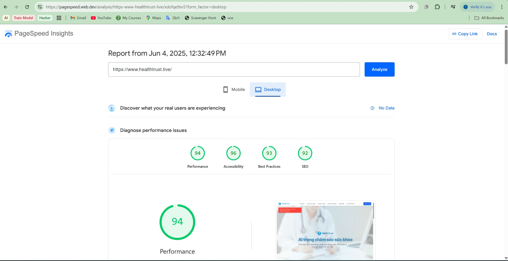

On Mobile.
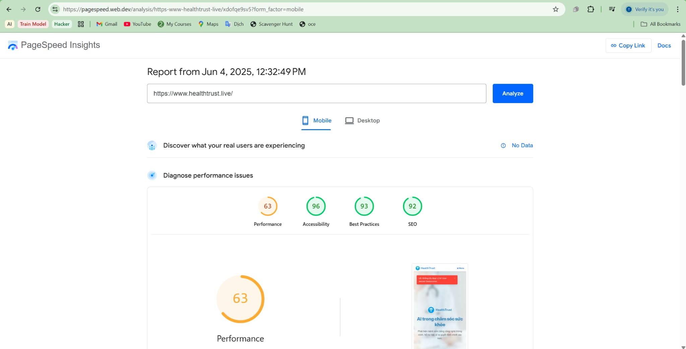
---
# Sơ đồ kiến trúc tổng quan hệ thống.

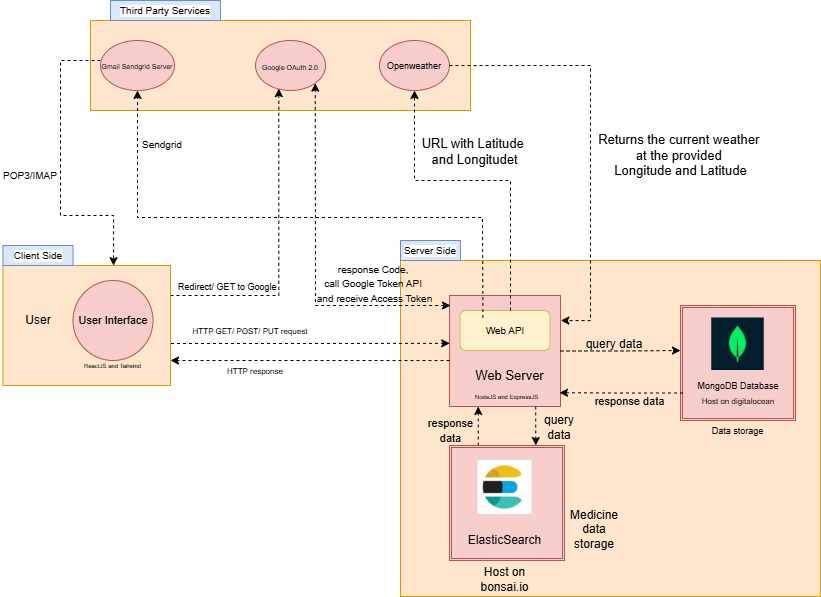

Hệ thống được chia thành ba phần chính:

---

## 1. Client Side (Phía Client)

- **Thành phần**: Ứng dụng website
- **Công nghệ**: ReactJS, Tailwind CSS
- **Chức năng chính**:
  - Hiển thị giao diện người dùng (User Interface)
  - Nhận đầu vào từ người dùng và xử lý tương tác
  - Gửi các yêu cầu HTTP đến Server thông qua API
  - Tiếp nhận dữ liệu trả về từ Server để cập nhật giao diện

---

## 2. Server Side (Phía Server)

- **Thành phần**: Hệ thống API
- **Công nghệ**: Node.js, Express.js
- **Cơ sở dữ liệu**: MongoDB, ElasticSearch
- **Chức năng chính**:
  - Xử lý các yêu cầu API từ Client
  - Truy vấn cơ sở dữ liệu MongoDB, ElasticSearch (truy vấn khi tìm kiếm thuốc)
  - Xác thực người dùng (Authentication)
  - Xử lý logic nghiệp vụ (ví dụ: gửi email, lấy dữ liệu thời tiết,...)
  - Trả về kết quả (HTTP Response) cho phía Client

---

## 3. Third Party Services (Các dịch vụ bên thứ ba)

- **SendGrid**:
  - Dùng để gửi email từ Server đến Client (ví dụ: xác thực tài khoản, đặt lại mật khẩu,...)
  - Giao thức: SMTP

- **Google OAuth 2.0**:
  - Cho phép người dùng đăng nhập bằng tài khoản Google
  - Server trao đổi mã `authorization code` để lấy `access_token`/`id_token` từ Google

- **OpenWeather**:
  - Cung cấp dữ liệu thời tiết (nhiệt độ, độ ẩm, điều kiện thời tiết,...)
  - Server gọi API của OpenWeather để lấy thông tin phục vụ các tính năng như dự báo thời tiết hoặc nhắc nhở sức khỏe

---

# Truyền thông giữa các thành phần

## 1. Client ↔ Server

- **Mục đích**: Giao tiếp dữ liệu khi người dùng tương tác với giao diện
- **Cách thức**:
  - Client (ReactJS) gửi các HTTP request (GET, POST, PUT, DELETE) đến các API endpoint của Server (Express.js)
  - Server xử lý yêu cầu, có thể truy vấn MongoDB, sau đó trả về HTTP response (thường là JSON) cho Client

## 2. Server ↔ Third Party Services ↔ Client

### Gửi email qua Gmail SMTP:
- Khi cần gửi email (xác thực, quên mật khẩu,...), Server sử dụng SMTP để gửi thông qua Gmail
- Nội dung email được tạo sẵn và được gửi tới người dùng

### Lấy dữ liệu thời tiết từ OpenWeather:
- Server gọi HTTP GET tới API của OpenWeather kèm theo API Key và thông số địa lý
- Nhận dữ liệu JSON từ OpenWeather, xử lý và trả về kết quả cho Client hiển thị

## 3. Client ↔ Third Party Services (OAuth 2.0)

### Đăng nhập bằng Google:
1. Người dùng nhấn "Đăng nhập với Google" trên giao diện ReactJS
2. Client chuyển hướng tới `/auth/google` trên Server
3. Server sử dụng Passport để chuyển hướng trình duyệt đến Google (authorization endpoint)
4. Sau khi xác thực, Google chuyển hướng về `/auth/google/callback` cùng với authorization code
5. Server trao đổi mã code để lấy `access_token` hoặc `id_token`, sau đó lấy thông tin người dùng, tạo JWT (hoặc session), lưu cookie và chuyển hướng trở lại ứng dụng Client

---

## Cơ sở dữ liệu (MongoDB)
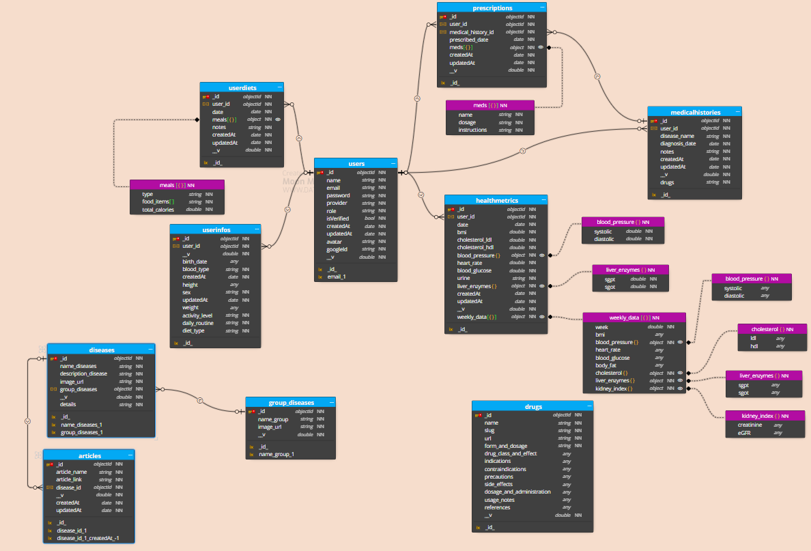

---
## Tính năng chính

- Đăng nhập, đăng ký:
  - Tạo tài khoản mới.
  - Đăng nhập để sử dụng các chức năng cá nhân hóa.
  - Quên mật khẩu? Có thể đặt lại dễ dàng qua email.
  - Thay đổi mật khẩu dễ dàng trong phần cài đặt.
- Cảnh báo sức khỏe theo vị trí:
  - Ứng dụng sẽ hỏi quyền truy cập vị trí của bạn (chỉ khi được cho phép).
  - Khi được cấp quyền truy cập vị trí, hệ thống sẽ tự động đưa ra cảnh báo về thời tiết và các nguy cơ sức khỏe liên quan (nắng nóng, cảm lạnh, v.v.).
- Tra cứu thuốc:
  - Tìm kiếm tên thuốc, công dụng, cách dùng và chống chỉ định.
  - Hỗ trợ tìm kiếm thông minh kể cả khi không nhớ chính xác tên thuốc.
- Tra cứu thông tin bệnh:
  - Cung cấp thông tin về triệu chứng, nguyên nhân, cách điều trị các bệnh thường gặp.
  - Nội dung được chọn lọc từ các nguồn y tế uy tín.
- Công cụ tính toán sức khỏe:
  - **BMI** – tính chỉ số khối cơ thể.
  - **Nhu cầu calo hằng ngày** – tính toán theo giới tính, tuổi, chiều cao, cân nặng và mức độ vận động.
  - **Cân nặng lý tưởng** – gợi ý mức cân phù hợp theo chiều cao và độ tuổi.
  - **Tỷ lệ mỡ cơ thể** – ước tính dựa trên các thông số như vòng cổ, vòng eo, chiều cao.
- Lịch hiến máu:
  - Hiển thị các đợt hiến máu theo khu vực gần nhất.
- Tin tức sức khỏe:
  - Cập nhật tin tức theo nhóm bệnh: tim mạch, hô hấp, thần kinh,...
  - Nguồn tin được chọn lọc từ báo chí và tổ chức y tế có độ tin cậy cao.
- Phân tích hình ảnh da liễu:
  - Cho phép tải lên ảnh vùng da bị tổn thương để phân tích.
  - Hệ thống sử dụng mô hình học sâu để hỗ trợ nhận diện một số bệnh lý da phổ biến (ví dụ: mụn, vảy nến,...).
- Chatbot tư vấn:
  - Hỗ trợ trò chuyện (cho phép gửi ảnh và voice), cung cấp thông tin liên quan đến các vấn đề sức khỏe.
- Hệ thống gợi ý bài báo liên quan:
  - Dựa trên bệnh nền của bệnh nhân trong Personal Tracker để đưa top 3 bài báo liên quan nhất phù hợp với bệnh nhân.
---
## Công nghệ sử dụng.

| Thành phần        | Mô tả                                                             |
| ----------------- | ----------------------------------------------------------------- |
| Giao diện         | ReactJS, TailwindCSS – tối ưu trải nghiệm người dùng, tốc độ cao. |
| Máy chủ (Backend) | Node.js + Express.js – xử lý dữ liệu và điều phối các chức năng.  |
| Cơ sở dữ liệu     | MongoDB – lưu trữ thông tin người dùng và dữ liệu liên quan.      |
| Tính năng AI      | Mô hình học sâu cho phân tích ảnh, chatbot AI, định vị địa lý     |

---

## Luồng đăng ký & đăng nhập
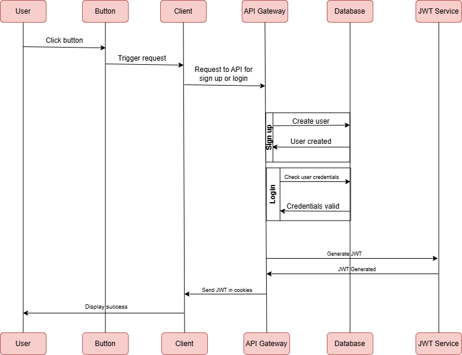

## 1. Đăng ký (Singup)

1. **User → Client**  
   - Điền form (email, mật khẩu, …) → bấm “Đăng ký”.

2. **Client → API Gateway**  
   - Gửi `POST /auth/register` kèm payload:
     ```json
     {
       "email": "user@example.com",
       "password": "P@ssw0rd"
       // … các trường khác
     }
     ```

3. **API Gateway**  
   - **Lưu thông tin đăng ký tạm thời** trong session của backend (chưa lưu vào Database).  
   - **Sinh mã OTP** (6 chữ số), lưu kèm `otp_code` và `otp_expires_at` cho user trong session.  
   - **Gửi email** chứa mã OTP đến địa chỉ user (qua Mail Service).  
   - **Trả về Client**: HTTP 200 (đã gửi OTP thành công).

4. **Client hiển thị form nhập OTP**  
   - Hiển thị giao diện yêu cầu người dùng nhập “Mã OTP” (6 chữ số).

5. **User → Client**  
   - Nhập “mã OTP” → bấm “Xác thực OTP”.

6. **Client → API Gateway**  
   - Gửi `POST /auth/verify-otp-register` kèm payload:
     ```json
     {
       "email": "user@example.com",
       "otp": "123456"
     }
     ```

7. **API Gateway**  
   - Lấy record user từ session trong backend, so sánh `otp` và kiểm tra còn thời hạn (chưa hết `otp_expires_at`).  
   - **Nếu OTP đúng & chưa hết hạn**:
     1. Cập nhật `is_verified = true` cho user trong session (hoặc khi cần, lưu vào Database).  
     2. Xóa (hoặc vô hiệu hóa) `otp_code` khỏi session.  
     3. Trả về Client: HTTP 200 (xác thực thành công).  
   - **Nếu OTP sai hoặc hết hạn**:  
     - Trả về Client: HTTP 400 hoặc HTTP 401 (OTP không hợp lệ).

8. **Client nhận kết quả**  
   - Nếu thành công → hiển thị “Đăng ký thành công” và chuyển sang trang Đăng nhập.  
   - Nếu thất bại → hiển thị “OTP sai hoặc đã hết hạn, vui lòng thử lại hoặc gửi lại OTP”.

---

## 2. Đăng nhập (Login)

1. **User → Client**  
   - Điền form (email, mật khẩu) → bấm “Đăng nhập”.

2. **Client → API Gateway**  
   - Gửi `POST /login` kèm payload:
     ```json
     {
       "email": "user@example.com",
       "password": "P@ssw0rd"
     }
     ```

3. **API Gateway**  
   - Truy vấn Database tìm user theo `email`.  
   - Kiểm tra:
     - Nếu user không tồn tại **hoặc** `is_verified = false` → trả lỗi HTTP 401.  
     - Nếu tồn tại **và** `is_verified = true`, so sánh hash mật khẩu:
       - Sai → trả lỗi HTTP 401.  
       - Đúng → tiếp tục bước kế.

4. **API Gateway → JWT Service**  
   - Gửi payload để tạo JWT.

5. **JWT Service → API Gateway**  
   - Trả về token JWT đã ký.

6. **API Gateway → Client**  
   - **Set cookie** `HttpOnly`.  
   - HTTP 200 “Đăng nhập thành công”.

7. **Client**  
   - Lưu token (trong cookie hoặc localStorage).  
   - Hiển thị “Đăng nhập thành công” → chuyển hướng sang trang chính (dashboard).

8. **Các request sau** (protected endpoints)  
   - Client tự động kèm JWT trong cookie để API Gateway xác thực.

---

## Luồng chặn gọi API liên quan đến user khi chưa đăng nhập:
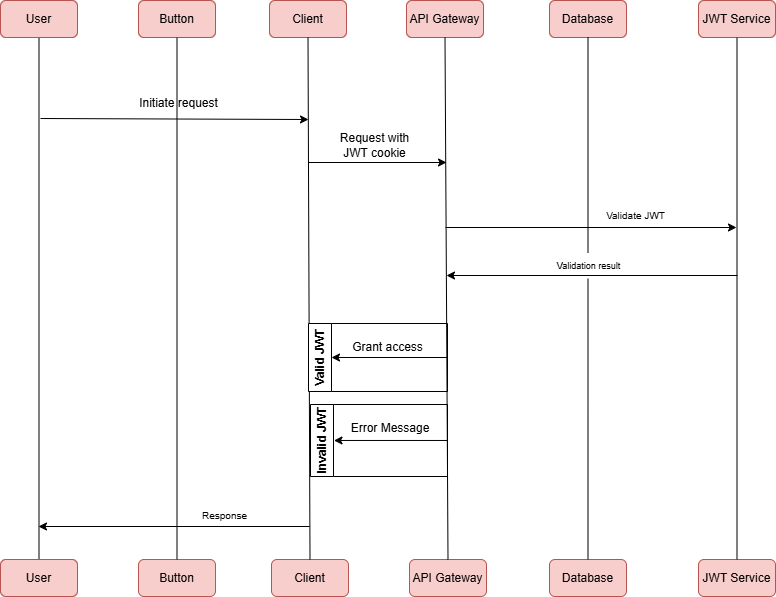


## 🧱 Cấu trúc Giao diện Tìm kiếm Thuốc

Tại trang **Thông tin thuốc**, người dùng sẽ thấy:

- 🟦 Một **thanh tìm kiếm (search bar)** để nhập từ khóa cần tìm.
- 📋 Một **danh sách các tên thuốc**, được **sắp xếp theo thứ tự chữ cái** để dễ tra cứu.
- 🔍 Khi **người dùng nhấn vào một tên thuốc**, hệ thống sẽ hiển thị **chi tiết thông tin thuốc** tương ứng (thành phần, công dụng, liều dùng, v.v.).

---

## ⚙️ Cơ chế Hoạt động của Tính năng Tìm kiếm

### 1. Sự kiện Người dùng Nhập Từ khóa

- Hệ thống **lắng nghe sự kiện `input`** từ ô tìm kiếm.
- Mỗi khi người dùng nhập một ký tự, frontend sẽ gửi một request đến backend thông qua API: `GET /health/search?q=keyword`


---

### 2. Truy vấn tới Elasticsearch

- Backend nhận request từ frontend, sau đó thực hiện **truy vấn đến Elasticsearch** để tìm kiếm dữ liệu.
- Elasticsearch được triển khai thông qua nền tảng **[bonsai.io](https://bonsai.io/)**.
- Chỉ mục (index) đang được sử dụng có tên là `drugs`, trong đó mỗi tài liệu (document) chứa thông tin thuốc, đặc biệt có trường `name` đại diện cho tên thuốc.

---

### 3. Tìm kiếm Chính xác và Gần đúng theo Tên thuốc

- Elasticsearch sẽ thực hiện việc **so khớp chính xác từ khóa với trường `name`** để trả về các kết quả phù hợp.

- Ngoài ra, hệ thống còn sử dụng các kỹ thuật:
- ✅ **Gợi ý (suggest)**
- ✅ **So khớp gần đúng (fuzzy match)**

Nhằm hỗ trợ người dùng trong các trường hợp:

- 🔡 Nhập sai chính tả
- 🔤 Nhập thiếu ký tự
- 🔠 Nhập ký tự đầu (ví dụ: chỉ gõ `"p"`)

- Elasticsearch sẽ **so sánh từ khóa với trường `name`**, và trả về **tối đa 10 kết quả gần đúng và phù hợp nhất**.

- Các kết quả được gửi lại frontend và hiển thị trong danh sách thuốc, giúp người dùng **chọn nhanh và chính xác** loại thuốc mình đang tìm.

---


# AI phân tích bệnh da liễu.
## Disease Detection & AI Chatbot Web App

## Giới thiệu mô hình AI nhận diện bệnh

Dự án sử dụng **mô hình học sâu (deep learning)** để phân loại các bệnh da liễu dựa trên ảnh chụp. Dưới đây là một số thông tin chính về quá trình xây dựng và huấn luyện mô hình:

- **Dataset:**  
  Mô hình được train trên bộ dữ liệu [DermNet](https://www.dermnet.com/) hoặc một tập ảnh da liễu đã được phân loại sẵn thành các thư mục theo từng loại bệnh.  
  Dataset được chia thành hai phần: `train` và `test` để đảm bảo đánh giá chính xác.

- **Kiến trúc mô hình:**  
  Sử dụng **DenseNet-121** — một kiến trúc mạng nơ-ron sâu mạnh mẽ, đặc biệt hiệu quả cho phân loại ảnh y tế.

  - **Pretrained:** Mô hình khởi tạo từ trọng số đã được huấn luyện trên tập **ImageNet** (hơn 1 triệu ảnh tự nhiên), giúp mô hình học đặc trưng hình ảnh tốt hơn và giảm thời gian train.
  - **Fine-tune:** Lớp phân loại cuối cùng được thay thế để phù hợp với số lượng class (bệnh) cụ thể của bộ dữ liệu da liễu.

- **Tiền xử lý:**

  - Ảnh được resize về 512x512 pixel.
  - Áp dụng các kỹ thuật tăng cường dữ liệu (augmentation): lật, xoay, điều chỉnh sáng/tối, v.v.
  - Chuẩn hóa giá trị ảnh theo thống kê của ImageNet.

- **Huấn luyện:**

  - Loss function: CrossEntropyLoss (phân loại nhiều lớp).
  - Optimizer: Adam, có weight decay để giảm overfitting.
  - Learning rate scheduler: Giảm learning rate khi mô hình không còn cải thiện trên tập validation.
  - Đánh giá mô hình bằng các chỉ số: Accuracy, F1-score, Confusion Matrix.

- **Kết quả đầu ra:**  
  Khi dự đoán, mô hình trả về **top 3 bệnh có xác suất cao nhất** cho ảnh mà người dùng gửi lên.

---

## Luồng hoạt động hệ thống

1. Người dùng tải ảnh da liễu lên giao diện web.
2. Ảnh được gửi đến backend.
3. Backend lưu ảnh và gọi mô hình AI (DenseNet-121) để phân tích.
4. Mô hình trả về dự đoán top 3 bệnh, backend gửi lại cho frontend.
5. Giao diện hiển thị kết quả cho người dùng.

## Sơ đồ hệ thống: Quy trình Nhận diện Bệnh qua Ảnh

### 1. Sơ đồ tổng quan (từ frontend đến backend và AI model)
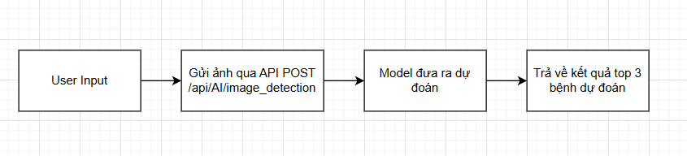

---

### 2. Diễn giải chi tiết từng bước

#### Bước 1: Người dùng thao tác trên giao diện

- Người dùng click chọn "Nhận diện bệnh qua ảnh".
- Chọn/tải ảnh cần nhận diện.

#### Bước 2: Gửi ảnh lên backend

- Hàm `predictDisease(imageFile)` được gọi khi người dùng nhấn "Phân tích ảnh".
- Ảnh được đóng gói vào `FormData`, gửi POST request lên endpoint `/api/AI/image_detection`.

```javascript
export async function predictDisease(imageFile) {
  const formData = new FormData();
  formData.append("image", imageFile);
  const response = await fetch("/api/AI/image_detection", {
  method: "POST",
  body: formData,
  });
  if (!response.ok) throw new Error("Upload failed");
  return await response.json();
}
```

#### Bước 3: Backend nhận, xử lý và gọi AI model

- API backend nhận file ảnh từ request (sử dụng multer để lưu file tạm).
- Backend gọi script Python (`predict.py`) bằng Node.js (child_process).
- Ảnh được đưa vào model AI (đã train trước bằng PyTorch).

#### Bước 4: AI model dự đoán

- Script Python load model, tiền xử lý ảnh, dự đoán ra top các bệnh và xác suất.
- Trả kết quả về dạng JSON (success, predictions).

#### Bước 5: Backend trả kết quả

- Backend nhận kết quả từ Python, xóa file tạm, gửi dữ liệu JSON về frontend.

#### Bước 6: Frontend hiển thị kết quả

- Frontend nhận kết quả, cập nhật UI hiển thị cho người dùng: Top 3 bệnh dự đoán và xác suất.

---

### 3. Tóm tắt vai trò các thành phần

- **Frontend (React):** Hiển thị UI, xử lý upload ảnh, gửi request và nhận kết quả, trình bày kết quả cho người dùng.
- **Backend (Node.js/Express):** Nhận ảnh, lưu tạm, gọi mô hình AI, trả kết quả.
- **AI Model (Python/PyTorch):** Phân tích ảnh, dự đoán bệnh, trả JSON kết quả.

---

### 4. Ưu điểm của kiến trúc này

- Phân tách rõ ràng frontend, backend và AI model.
- Có thể mở rộng dễ dàng cho nhiều loại bệnh, mô hình khác, hoặc tích hợp thêm chức năng (ví dụ chatbot, tra cứu, lịch sử...).
- Đảm bảo bảo mật: Ảnh chỉ xử lý tạm thời, backend kiểm soát request.

---


---
# Chatbot AI Sử Dụng Kỹ Thuật RAG (Retrieval-Augmented Generation)
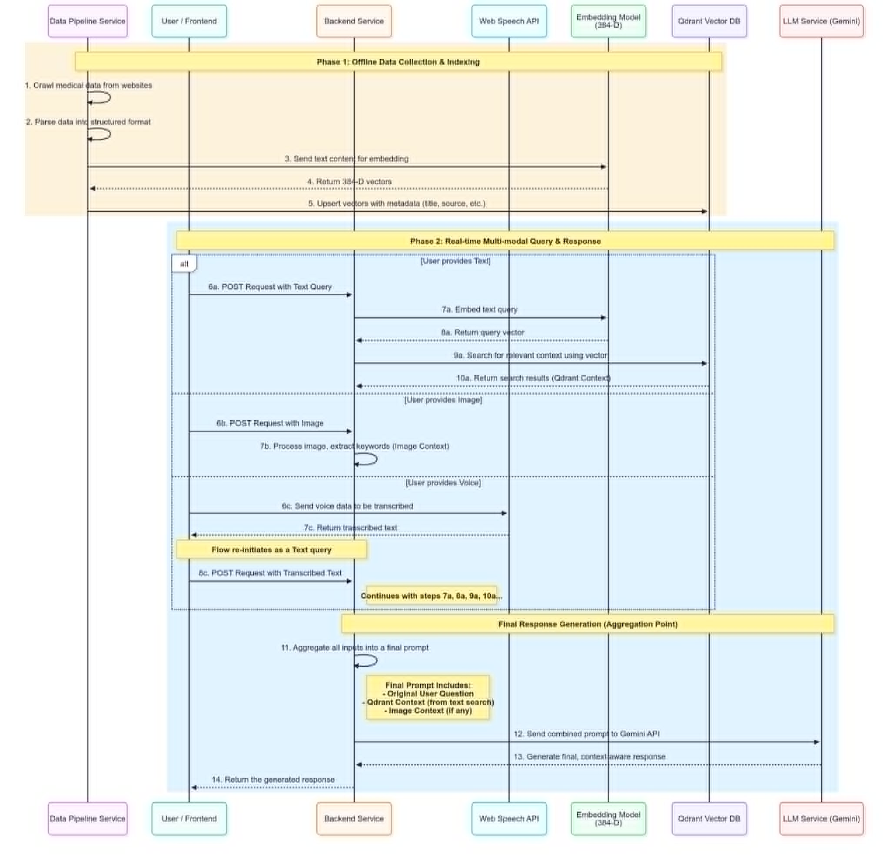

Đây là hệ thống chatbot thông minh được thiết kế để hỗ trợ người dùng trong việc tra cứu thông tin sức khỏe một cách chính xác và dễ hiểu. Chatbot sử dụng kỹ thuật tiên tiến có tên là RAG - Retrieval-Augmented Generation, hay còn gọi là Tìm kiếm tăng cường tạo sinh. Điều này có nghĩa là chatbot không chỉ tạo câu trả lời dựa trên kiến thức đã học sẵn, mà còn chủ động tìm kiếm thông tin liên quan trong một kho dữ liệu riêng, giúp tăng độ chính xác và tính cập nhật của phản hồi.

## 1. Thu thập và xử lý dữ liệu ban đầu
Để chatbot có kiến thức y tế đáng tin cậy, dữ liệu cần được chuẩn bị kỹ lưỡng qua các bước sau:

### **Bước 1:** Thu thập thông tin

- Chatbot được "nuôi dưỡng" bằng thông tin từ các trang web y tế có uy tín (Vinmec).

- Các thông tin này có thể bao gồm bài viết, hướng dẫn, thống kê, và tài liệu chuyên môn.

### **Bước 2:** Chuẩn hóa định dạng

- Sau khi thu thập, dữ liệu được chuyển thành định dạng có cấu trúc (JSON). Việc chuẩn hóa này giúp hệ thống xử lý và hiểu thông tin dễ dàng hơn.

### **Bước 3:** Chuyển nội dung thành dữ liệu số

- Các đoạn văn bản được đưa vào một mô hình đặc biệt gọi là mô hình nhúng (embedding model). Mô hình này sẽ chuyển văn bản thành vector – tập hợp các con số có thể hiểu như “ý nghĩa số học” của đoạn văn bản.

- Mỗi đoạn nội dung trở thành một vector có 384 chiều (tức là có 384 giá trị số biểu diễn nội dung đó).

### **Bước 4:** Lưu trữ vào cơ sở dữ liệu vector

- Các vector này được lưu vào một cơ sở dữ liệu chuyên dụng cho mục đích lưu trữ và tìm kiếm vector, gọi là Qdrant, cho phép chatbot sau này tìm kiếm những đoạn thông tin phù hợp một cách nhanh chóng và chính xác.

## 2. Tiếp nhận và xử lý câu hỏi từ người dùng
Khi người dùng muốn hỏi điều gì đó, chatbot sẽ thực hiện các bước sau:

### **Trường hợp người dùng nhập văn bản**

- Người dùng gõ câu hỏi bằng văn bản (ví dụ: “Triệu chứng của bệnh tiểu đường là gì?”).

- Câu hỏi này cũng được chuyển thành vector bằng cùng mô hình nhúng như trên.

- Vector câu hỏi được dùng để tìm trong cơ sở dữ liệu Qdrant những đoạn thông tin gần giống nhất về mặt nội dung.

### **Trường hợp người dùng tải lên hình ảnh**

- Ví dụ, người dùng gửi ảnh chụp kết quả xét nghiệm với các thông số như Nồng độ tiểu cầu trong máu: 50, Huyết áp: 90, Cân nặng: 90, ....

- Hệ thống sẽ xử lý ảnh sẽ trích xuất các từ khóa quan trọng kèm thông số mô tả (Huyết áp: 90) và lưu vào user_data để tạo ngữ cảnh.

### **Trường hợp người dùng nói trực tiếp**

- Người dùng có thể nói vào micro.

- Một công cụ chuyển giọng nói thành văn bản (như Web Speech API) sẽ xử lý âm thanh thành câu hỏi văn bản.

- Sau đó, chatbot tiếp tục xử lý như với văn bản gõ tay.

## 3. Tạo ra câu trả lời
Sau khi hiểu câu hỏi và truy xuất được các đoạn thông tin liên quan, chatbot sẽ tiến hành trả lời như sau:

### **Tổng hợp dữ liệu từ nhiều nguồn**

- Các đoạn văn bản phù hợp nhất từ Qdrant sẽ được lấy ra. Mỗi đoạn đều có thông tin như: tiêu đề bài viết, nguồn gốc, và liên kết gốc.

- Nếu có thông tin trích xuất từ hình ảnh hoặc các triệu chứng cũ từ phản hồi trước đó của user, chúng cũng được đưa vào làm ngữ cảnh.

### **Tạo câu trả lời bằng mô hình ngôn ngữ lớn**

- Toàn bộ ngữ cảnh sẽ được gửi tới một Mô hình Ngôn ngữ Lớn (LLM - Large Language Model), chẳng hạn như Gemini của Google.

- Mô hình này sẽ dựa trên ngữ cảnh để viết ra một câu trả lời rõ ràng, tự nhiên và dễ hiểu, giống như đang được một chuyên gia tư vấn.

### **Điểm mạnh của phương pháp này**

- Không trả lời theo kiểu học thuộc lòng.

- Tìm kiếm thông tin cập nhật, liên quan nhất trong thời điểm hiện tại.

- Phản hồi mang tính cá nhân hóa theo từng câu hỏi cụ thể.

## 4. Hướng phát triển trong tương lai
Để nâng cao độ chính xác, khả năng cập nhật và độ thông minh của chatbot, hệ thống có thể cải tiến theo các hướng sau:

### **1. Tăng chất lượng và tính hợp pháp của dữ liệu**

- Mua quyền truy cập API từ các trang y tế uy tín, để trích xuất trực tiếp dữ liệu chuẩn hóa và cập nhật theo thời gian thực. Một số nguồn có thể cung cấp API:

  Mayo Clinic API (nếu khả dụng)

  Health.gov

  CDC APIs

  OpenFDA

- Việc sử dụng API chính thức đảm bảo dữ liệu luôn mới, hợp pháp và chính xác hơn so với việc tự động thu thập.

### **2. Nâng cấp mô hình nhúng vector**

- Hiện tại hệ thống dùng mô hình nhúng 384 chiều.

- Có thể cải tiến bằng cách sử dụng mô hình có nhiều chiều hơn (ví dụ: 768, 1024, hoặc 1536 chiều) để tăng độ chính xác khi biểu diễn ý nghĩa văn bản.

### **3. Hỗ trợ đa ngôn ngữ tốt hơn**

- Bổ sung khả năng hiểu và trả lời bằng nhiều ngôn ngữ (ví dụ tiếng Việt, tiếng Anh, tiếng Nhật…) giúp mở rộng đối tượng người dùng.

### **4. Cải thiện khả năng hiểu hình ảnh y tế**

- Tích hợp các mô hình thị giác máy tính (Computer Vision) để phân tích ảnh chụp X-quang, phiếu xét nghiệm, hoặc ảnh siêu âm.

## Tổng kết
Hệ thống chatbot y tế sử dụng công nghệ RAG là một bước tiến mới trong việc tạo ra câu trả lời chính xác, dễ hiểu và có cơ sở rõ ràng cho người dùng. Nhờ vào khả năng kết hợp giữa tìm kiếm thông tin và ngôn ngữ tự nhiên, chatbot có thể hỗ trợ người bệnh hoặc người quan tâm đến sức khỏe một cách hiệu quả và tin cậy.

---
# 🧾 OCR & Trích Xuất Thông Tin Từ Hồ Sơ Bệnh Án

## 📄 Mô Tả Chức Năng

Tính năng cho phép người dùng tải lên hồ sơ bệnh án (ảnh, PDF, DOCX), thực hiện nhận diện ký tự (OCR), sau đó dùng mô hình AI để trích xuất và cấu trúc dữ liệu về thông tin cá nhân và các chỉ số sức khỏe, cuối cùng lưu kết quả vào cơ sở dữ liệu MongoDB.

## 🛠️ Công Nghệ Sử Dụng

* 🖼️ **OCR**: `pytesseract`, `pdf2image`, `docx2pdf`
* 🤖 **AI**: Google Gemini (qua thư viện `google.generativeai`)
* 💾 **Cơ sở dữ liệu**: MongoDB (qua thư viện Mongoose)

## 🔁 Quy Trình Hoạt Động

### 1. 👤 Người dùng chọn và gửi file

* Người dùng chọn file hồ sơ bệnh án (PNG, JPG, PDF, DOCX) thông qua giao diện web.
* File được đóng gói bằng `FormData` và gửi tới backend qua `Fetch API`.

### 2. 📥 Tiếp nhận và chuyển tiếp file

* Server Node.js nhận request và sử dụng `Multer` để lưu file tạm thời.
* Sau đó, server khởi chạy một tiến trình Python để thực hiện OCR thông qua file `ocr.py`.

### 3. 🧠 Xử lý OCR trong Python

* **Chuyển định dạng**:

  * File PDF được chuyển thành ảnh bằng `pdf2image`.
  * File DOCX được chuyển thành PDF qua `docx2pdf`, sau đó thành ảnh.
* **Nhận diện ký tự**: Text được trích xuất từ ảnh bằng `pytesseract`.
* **Tổng hợp văn bản**: Tất cả đoạn text từ ảnh được nối lại thành một chuỗi văn bản đầy đủ.

### 4. 🧬 Trích xuất dữ liệu y tế bằng AI

* Một prompt chi tiết được xây dựng và gửi tới mô hình Gemini để phân tích văn bản và xuất ra dữ liệu có cấu trúc dạng JSON.
* Kết quả JSON gồm các mục như: thông tin cá nhân, chỉ số sức khỏe, danh sách bệnh lý,...

### 5. 💽 Lưu kết quả và phản hồi

* Script Python trả về một JSON gồm: `raw_text`, `extracted_data`, `success` hoặc `error`.
* Backend kiểm tra kết quả:

  * Nếu thành công, dữ liệu sẽ được lưu vào MongoDB.
  * Kết quả cuối cùng được trả về client để hiển thị hoặc xử lý tiếp.

### 📹 Xem video demo

👉 [Click vào đây để xem video demo](https://drive.google.com/file/d/1AVKXuMHvX80cD4tQtYVJzsaRZMcEz9B1/view?usp=sharing)


---
# Hệ thống gợi ý bài báo liên quan.
Hệ thống này tự động gợi ý **top 3 bài báo y tế phù hợp nhất** với người dùng, dựa trên **bệnh nền được trích xuất từ hồ sơ cá nhân (personal tracker)**. Công nghệ lõi sử dụng bao gồm:

- **Mô hình nhúng ngữ nghĩa** 768 chiều (`bkai-foundation-models/vietnamese-bi-encoder`)
- **Vector database Qdrant** kết hợp thuật toán tìm kiếm hiệu quả **HNSW**
- **MongoDB** lưu trữ dữ liệu gốc về bệnh và bài báo liên quan
- Gợi ý báo cho các bệnh: Tim, tiểu đường, dạ dày, ung thư, thận, gan...

## Sơ đồ tổng quan hệ thống.
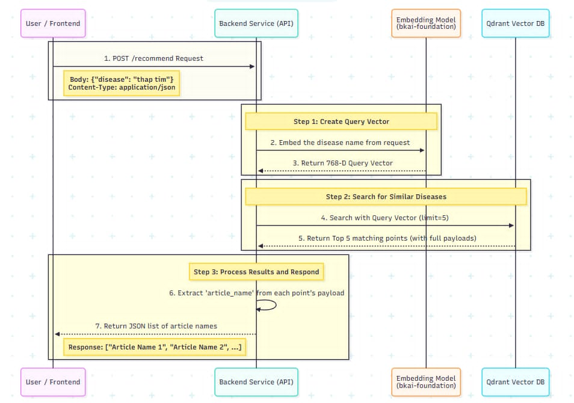

## 1. Chuẩn bị dữ liệu

### Bước 1: Trích xuất dữ liệu từ MongoDB

- Từ MongoDB, hệ thống lấy thông tin bệnh (`name_diseases`, `description_disease`) và danh sách bài báo liên quan (`articles[]`) như sau:

```json
{
  "name_diseases": "Mụn cóc",
  "description_disease": "Mụn cóc là bệnh da liễu thường gặp do virus HPV...",
  "articles": [
    {
      "article_name": "Cách chữa mụn cóc ở chân và cách phòng ngừa",
      "article_link": "https://giaan115.com/kien-thuc-y-khoa/..."
    },
    ...
  ]
}
```

### Bước 2: Tạo văn bản để embedding
- Dữ liệu đầu vào để nhúng sẽ là phần tên bệnh + mô tả:

```
combined_text = f"{disease_name}. {description}".strip()
texts_to_embed.append(combined_text)
```
- Dữ liệu đi kèm (payload) để lưu vào Qdrant gồm:

```
payloads.append({
    "disease_name": disease_name,
    "articles": articles
})
```
## 2. Nhúng văn bản bằng mô hình 768 chiều
- Mô hình sử dụng: bkai-foundation-models/vietnamese-bi-encoder (tối ưu cho tiếng Việt)

- Mỗi văn bản sẽ được chuyển thành một vector 768 chiều, biểu diễn ý nghĩa của bệnh và mô tả bệnh.

## 3. Lưu vào Qdrant vector database
- Các vector embedding cùng payload sẽ được lưu vào Qdrant, sử dụng cấu hình:

```
{
  "distance": "Cosine",
  "hnsw_config": {
    "m": 16,
    "ef_construct": 100
  }
}
```
- Việc lưu vào Qdrant giúp truy xuất các bệnh tương tự về mặt ngữ nghĩa cực kỳ nhanh chóng.

## 4. Truy xuất bài báo từ bệnh nền
### Xử lý từ backend
- Backend gọi script article_extraction.py, script này:

  - Nhúng lại thông tin bệnh nền của user thành vector

  - Truy vấn Qdrant để tìm top 3 bệnh gần nhất về mặt ý nghĩa

  - Từ đó trả về danh sách các bài báo tương ứng từ các payload articles[]

### Kết quả trả về
- Mỗi truy vấn trả về cấu trúc như sau:

[
  "Dấu hiệu ung thư dạ dày giai đoạn cuối",
  "Nội soi dạ dày có phát hiện ung thư không? Phương pháp chẩn đoán chính xác",
  "Khát quát về ung thư dạ dày",
  "Chỉ điểm 7 dấu hiệu ung thư dạ dày và cách phòng tránh bệnh",
  "Dấu hiệu khiến bạn nghĩ ngay đến ung thư dạ dày",
  "Yếu tố nguy cơ ung thư dạ dày"
]

- Frontend chỉ hiển thị 5 bài báo gợi ý đầu tiên, ưu tiên theo độ tương đồng embedding.
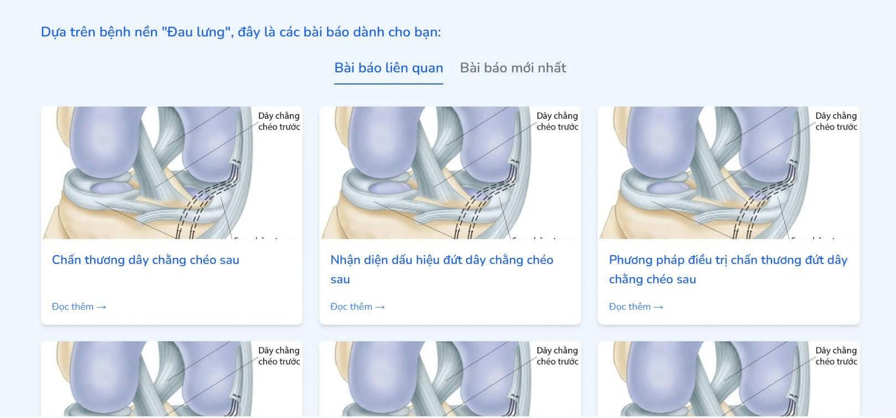
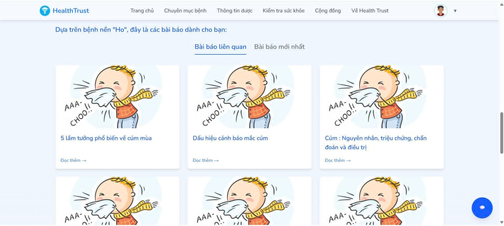
---
## Cách cài đặt và chạy dự án.

### Chạy Backend.
```bash
npm start
```

### Chạy Frontend.
#### Môi Trường Development
```bash
npm run dev
```
#### Môi Trường Production
```bash
npm run build
npx serve -s dist
```


<!-- #### 1. Luồng đăng ký, đăng nhập. -->

### Giao diện các chức năng chính.

Trang chủ.

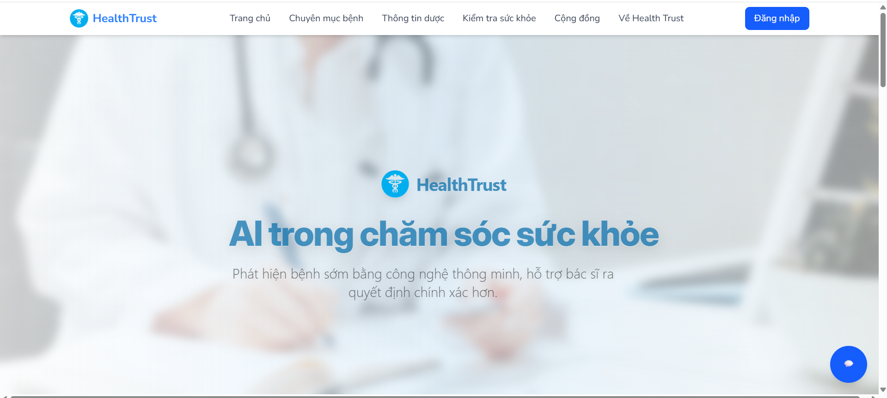

Đăng ký & xác minh.

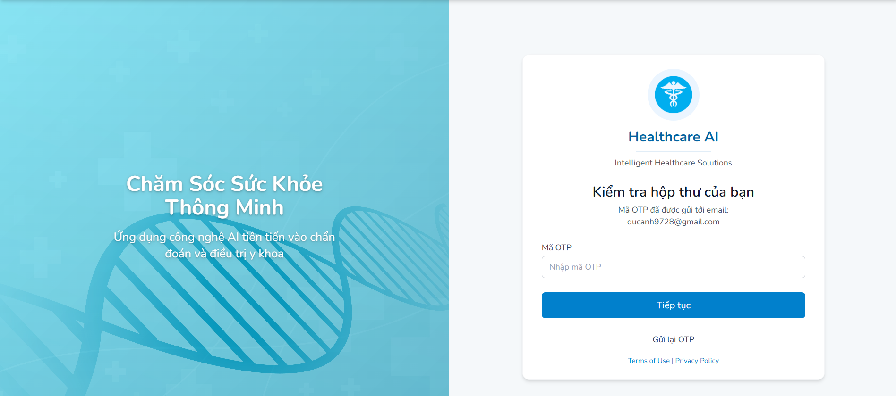

Đăng nhập.

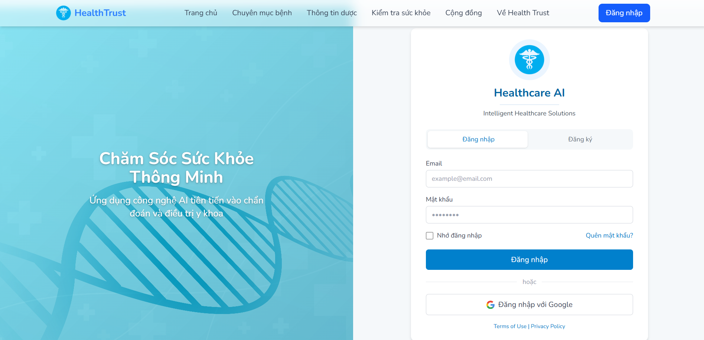

Quên mật khẩu.

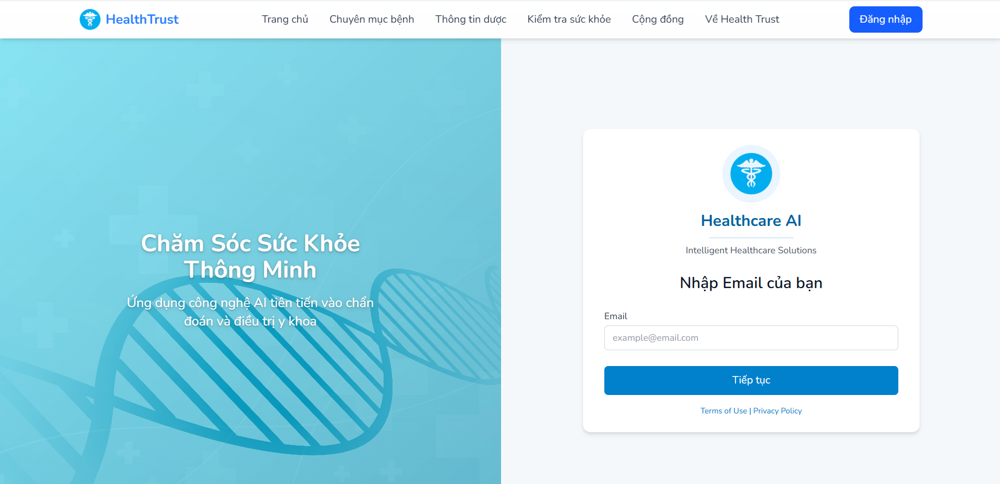

Trang Đối tác.

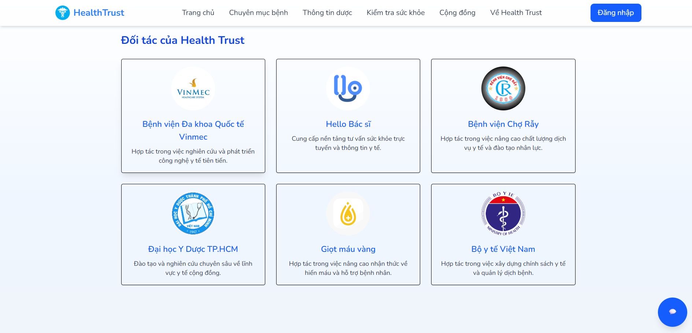

Trang Thành tựu & Giải thưởng.

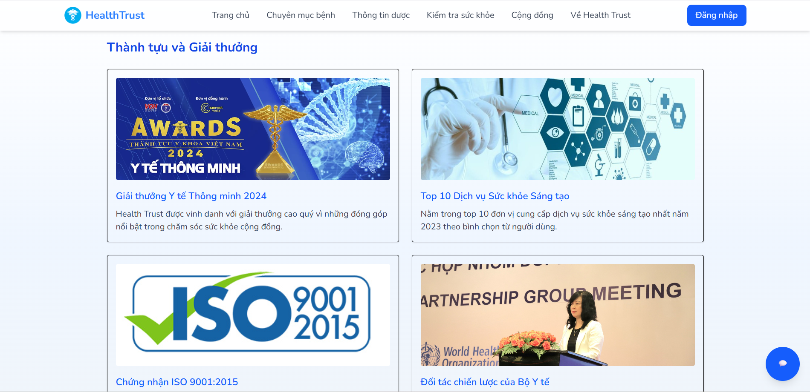

Trang Tin tức.

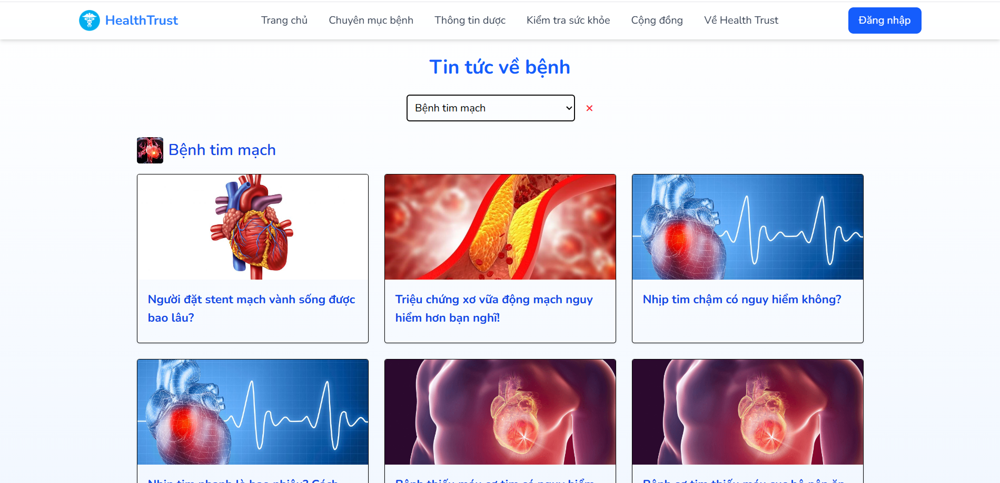

Trang Công cụ tính toán - BMI.

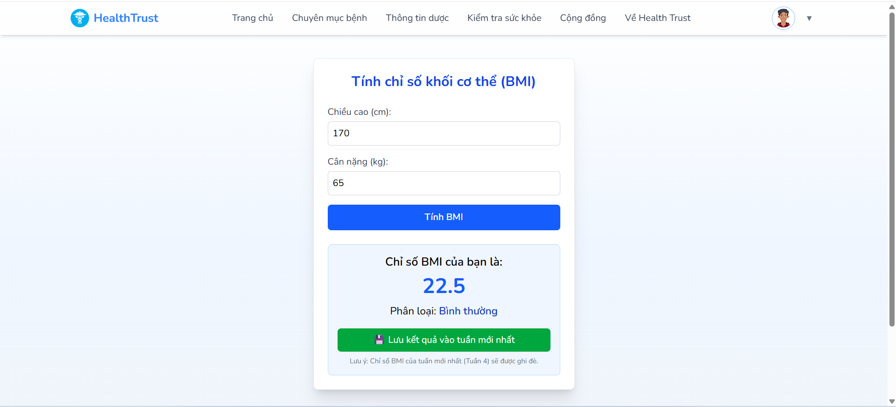

Trang Công cụ tính toán - Tính calo.

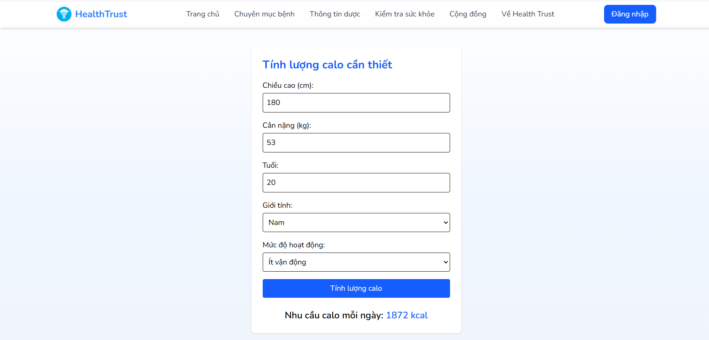

Trang Công cụ tính toán - Tính cân nặng lý tưởng.

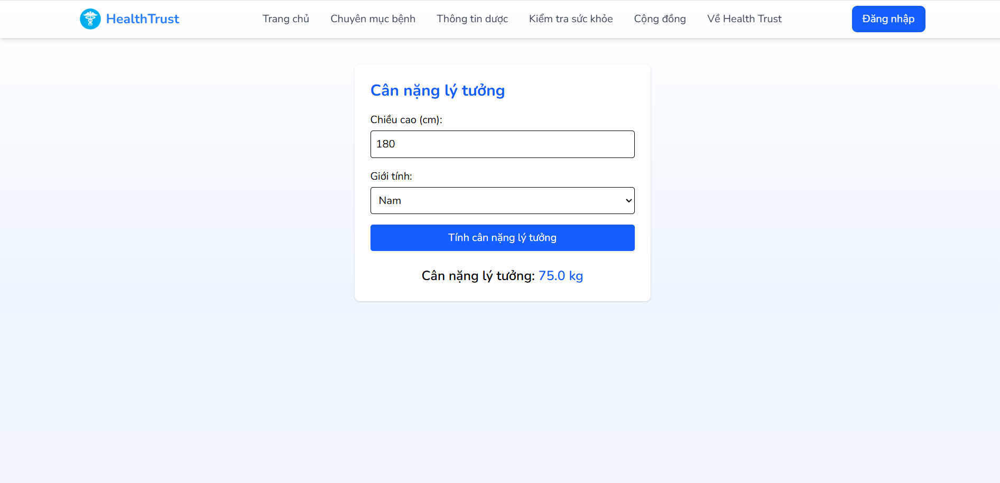

Trang Công cụ tính toán - Tỉ lệ mỡ.

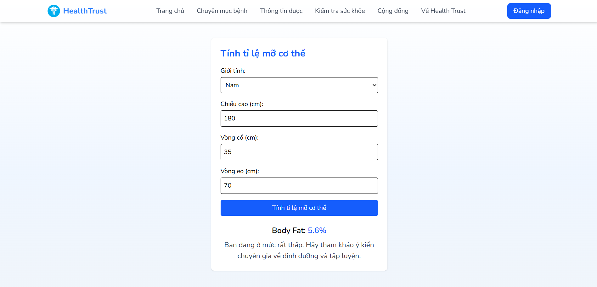

Trang Cộng đồng - Lịch hiến máu.

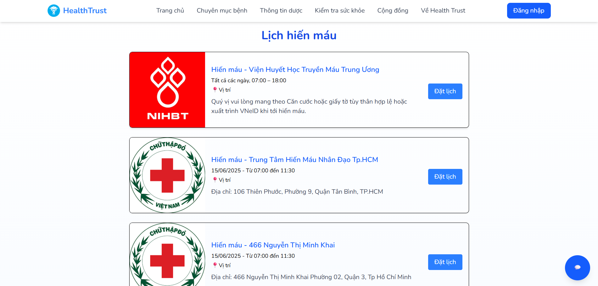

Trang Thông tin dược.

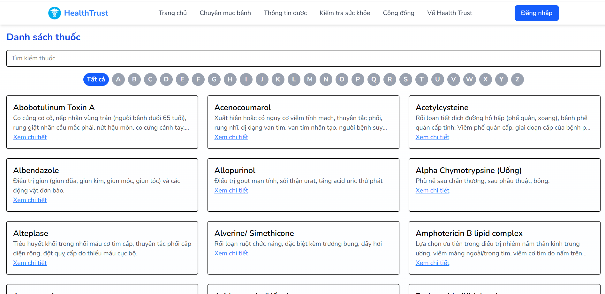

Chi tiết thông tin dược liệu.

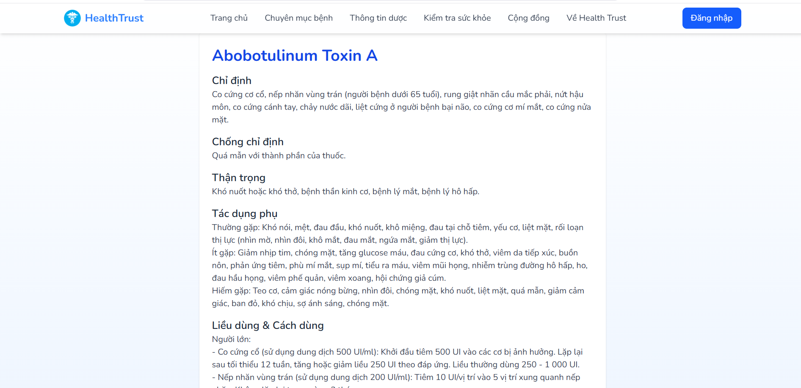

Tính năng - Cảnh báo sức khỏe dựa trên vị trí địa lí.

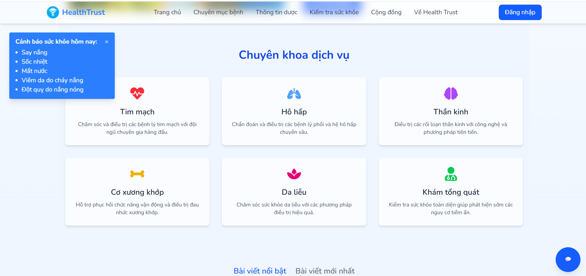

Tính năng - Chatbot tư vấn sức khỏe.

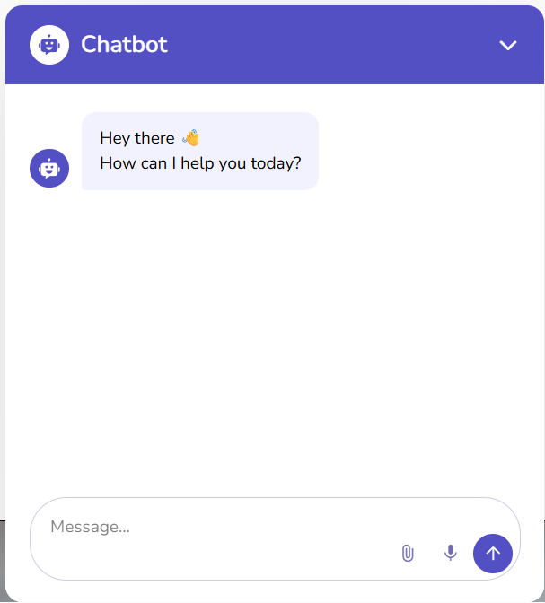

Tính năng - Phân tích bệnh da liễu bằng ảnh.

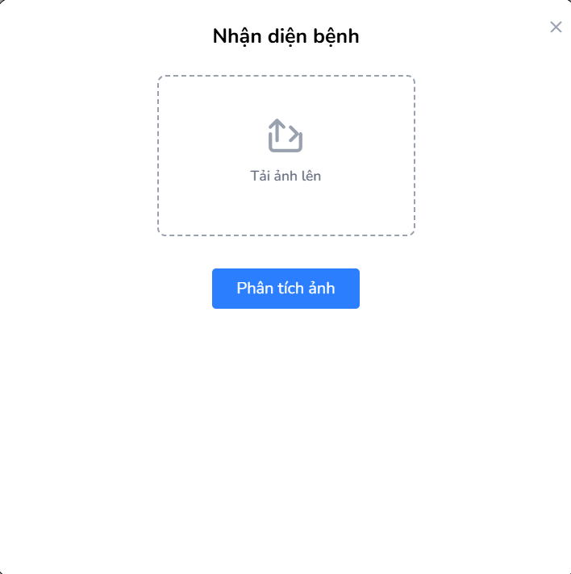

## Cấu hình Nginx

### 1. File: `/etc/nginx/nginx.conf`
```nginx
user www-data;
worker_processes auto;
pid /run/nginx.pid;
error_log /var/log/nginx/error.log;
include /etc/nginx/modules-enabled/*.conf;

events {
    worker_connections 768;
    # multi_accept on;
}

http {

    ##
    # Basic Settings
    ##

    sendfile on;
    tcp_nopush on;
    types_hash_max_size 2048;
    # server_tokens off;

    # server_names_hash_bucket_size 64;
    # server_name_in_redirect off;

    include /etc/nginx/mime.types;
    default_type application/octet-stream;

    ##
    # SSL Settings
    ##

    ssl_protocols TLSv1 TLSv1.1 TLSv1.2 TLSv1.3; # Dropping SSLv3, ref: POODLE
    ssl_prefer_server_ciphers on;

    ##
    # Logging Settings
    ##

    access_log /var/log/nginx/access.log;

    ##
    # Gzip Settings
    ##

    gzip on;

    gzip_vary on;
    gzip_proxied any;
    gzip_comp_level 6;
    gzip_min_length 1024;
    gzip_buffers 16 8k;
    gzip_http_version 1.1;
    gzip_types
        text/plain
        text/css
        application/json
        application/javascript
        text/xml application/xml
        application/xml+rss
        text/javascript
        application/x-font-ttf
        font/opentype
        application/vnd.ms-fontobject
        image/svg+xml
        application/font-woff
        application/font-woff2;

    ##
    # Virtual Host Configs
    ##

    include /etc/nginx/conf.d/*.conf;
    include /etc/nginx/sites-enabled/*;
}


#mail {
#    # See sample authentication script at:
#    # http://wiki.nginx.org/ImapAuthenticateWithApachePhpScript
#
#    # auth_http localhost/auth.php;
#    # pop3_capabilities "TOP" "USER";
#    # imap_capabilities "IMAP4rev1" "UIDPLUS";
#
#    server {
#        listen     localhost:110;
#        protocol   pop3;
#        proxy      on;
#    }
#
#    server {
#        listen     localhost:143;
#        protocol   imap;
#        proxy      on;
#    }
#}

## HTTPS Server Configuration

```nginx
server {
    server_name healthtrust.live www.healthtrust.live;

    root /var/www/healthtrust-client;
    index index.html;

    location /api/AI/ {
        proxy_pass http://localhost:5000/api/AI/;
        proxy_http_version 1.1;
        proxy_set_header Upgrade $http_upgrade;
        proxy_set_header Connection 'upgrade';
        proxy_set_header Host $host;
        proxy_cache_bypass $http_upgrade;
    }

    location /api/ {
        proxy_pass http://localhost:5000/api/;
        proxy_http_version 1.1;
        proxy_set_header Upgrade $http_upgrade;
        proxy_set_header Connection 'upgrade';
        proxy_set_header Host $host;
        proxy_cache_bypass $http_upgrade;
    }

    location /auth/ {
        proxy_pass http://localhost:5000/auth/;
        proxy_http_version 1.1;
        proxy_set_header Upgrade $http_upgrade;
        proxy_set_header Connection 'upgrade';
        proxy_set_header Host $host;
        proxy_cache_bypass $http_upgrade;
    }

    location /health/ {
        proxy_pass http://localhost:5000/health/;
        proxy_http_version 1.1;
        proxy_set_header Upgrade $http_upgrade;
        proxy_set_header Connection 'upgrade';
        proxy_set_header Host $host;
        proxy_cache_bypass $http_upgrade;
    }

    location / {
        try_files $uri /index.html;
    }

    listen 443 ssl http2;
    ssl_certificate /etc/letsencrypt/live/healthtrust.live/fullchain.pem;
    ssl_certificate_key /etc/letsencrypt/live/healthtrust.live/privkey.pem;
    include /etc/letsencrypt/options-ssl-nginx.conf;
    ssl_dhparam /etc/letsencrypt/ssl-dhparams.pem;
}
```

### HTTP to HTTPS Redirect

```nginx
server {
    if ($host = www.healthtrust.live) {
        return 301 https://$host$request_uri;
    }

    if ($host = healthtrust.live) {
        return 301 https://$host$request_uri;
    }

    listen 80;
    server_name healthtrust.live www.healthtrust.live;
    return 404;
}
```


---
## Bảng phân chia công việc.
| STT | Họ và Tên            | Vai trò/Nhiệm vụ chính |
|-----|----------------------|--------------------------|
| 1   | Nguyễn Thế Anh       | - Chỉnh sửa phần frontend và backend của form xác thực người dùng<br>- Hỗ trợ tăng tốc độ tải trang (PageSpeed)<br>- Phát triển mô hình học sâu nhận diện bệnh ngoài da<br>- Phát triển tính năng cảnh báo bệnh theo vị trí và thời tiết người dùng<br>- Giao và phân chia công việc trong nhóm<br>- Theo dõi tiến độ thực hiện dự án của các thành viên<br>- Deploy toàn bộ hệ thống trên cloud (DigitalOcean) sử dụng Nginx và cấu hình SSL<br>- Xử lý xung đột khi pull request lên nhánh chính<br>- Đăng ký Gmail đặc quyền để gửi OTP trên môi trường production<br>- Cấu hình các bản ghi MX và TXT để phục vụ email hệ thống<br>- Phát triển chatbot để cá nhân hóa theo thông tin của người dùng, hỗ trợ kết hợp thông tin prompt + thông tin cá nhân trước đó của bệnh nhân để ra câu trả lời khách quan nhất: bệnh nền, chỉ số y tế: BMI, nhịp tim, huyết áp,... |
| 2   | Nguyễn Đức Hùng      | - Phát triển nội dung chi tiết cho thông tin bệnh<br>- Phát triển backend cho tính năng personal tracker<br>- Chỉnh sửa giao diện tương ứng với các thay đổi backend<br>- Cải thiện điểm PageSpeed của website<br>- Hiển thị bài báo gợi ý lên giao diện người dùng<br>- Chỉnh sửa logic thay đổi avatar người dùng trên navbar |
| 3   | Nguyễn Quốc Vương    | - Kết nối frontend và backend cho form xác thực người dùng<br>- Phát triển frontend cho tính năng personal tracker<br>- Xây dựng hệ thống tìm kiếm thông tin dược phẩm sử dụng Elasticsearch<br>- Thiết kế giao diện cho chatbot AI<br>- Xây dựng tính năng OCR ảnh để lấy thông tin y tế từ hồ sơ bệnh án. |
| 4   | Huỳnh Gia Bảo        | - Thiết kế giao diện trang chủ<br>- Phát triển giao diện các trang giới thiệu, thông tin bệnh và thông tin thuốc<br>- Tối ưu điểm SEO của trang web |
| 5   | Phan Đức Anh         | - Phát triển RAG Chatbot AI chuyên môn hóa lĩnh vực y tế, hỗ trợ ghi nhớ ngữ cảnh và chuyển giọng nói thành văn bản<br>- Phát triển database Qdrant để phục vụ cho phần chatbot và gợi ý bài báo liên quan kết hợp AI<br>- Xây dựng hệ thống gợi ý bài báo y khoa dựa trên tình trạng bệnh nền của người dùng<br>- Xây dựng API phục vụ cho việc gọi và hiển thị top 3 bài báo liên quan trên frontend<br>- Thu thập và xử lý dữ liệu y tế để huấn luyện và nâng cao hiệu quả chatbot |
